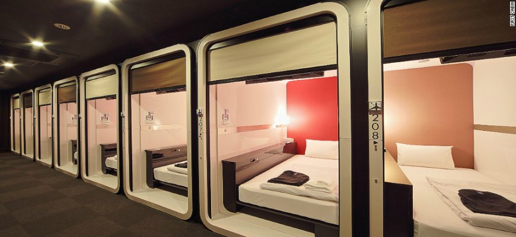
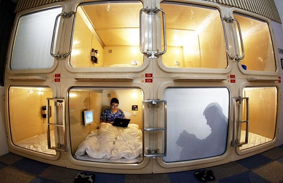
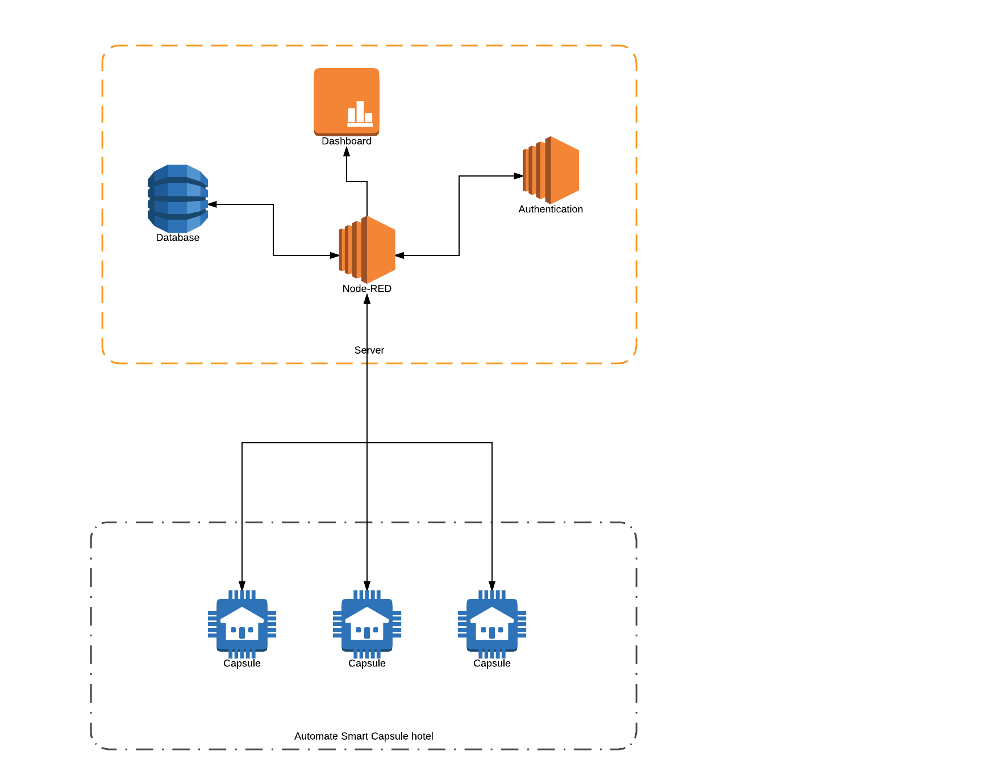

# IoT Capsule Hotel

Một dự án cho phép xây dựng và vận hành một khách sạn con nhộng tự động và tiện lợi. 

# Đặt vấn đề

# Giải pháp 
Xây dựng một hệ thống 
Bán lấy tiền

# Thiết kế

# Các thiết bị sử dụng
- Một mạch ESP8266
- OLED: Hiển thị số thời gian còn lại của phòng con nhộng, QR code thông tin phòng
- Servo: Để quản lý việc mở, đóng cửa
- Cảm biến khoảng cách: Kiểm tra còn người trong phòng không
- Cảm biến lửa: Quản lý cháy, tự gọi chữa cháy khi có cháy
- Cảm biến DHT: Quản lý nhiệt độ trong phòng
- Loa: Thống báo hết giờ ở trong phòng
- Đèn: Bật đèn, tắt đèn trong phòng tự động
- Rờ le: Ổ điện trong phòng

# Hướng dẫn người dùng

Mạch ESP8266 được kết nối với một 